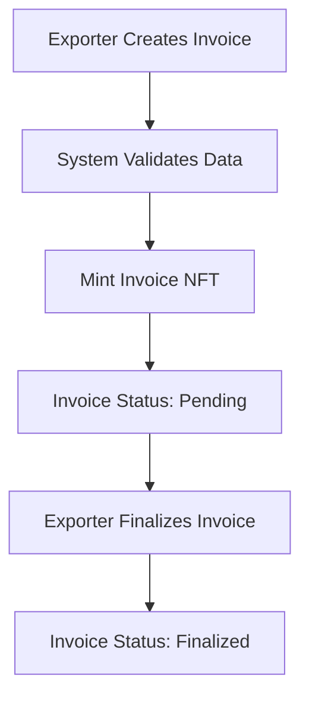
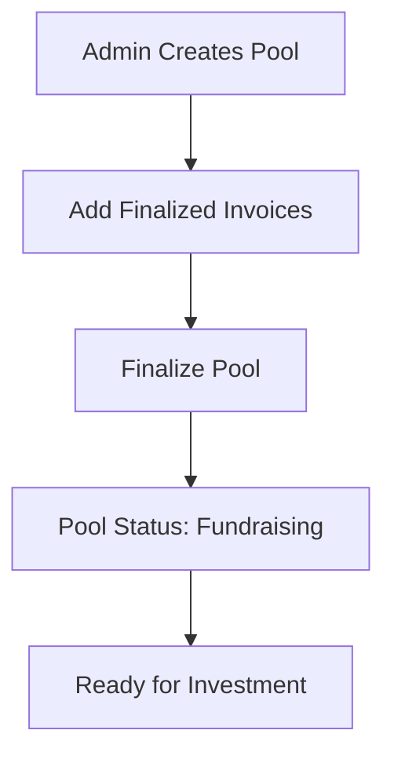
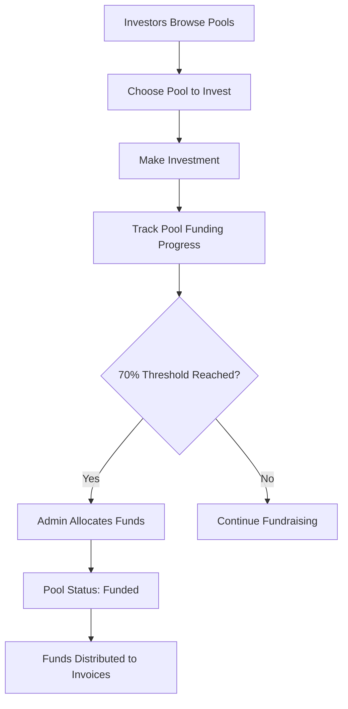
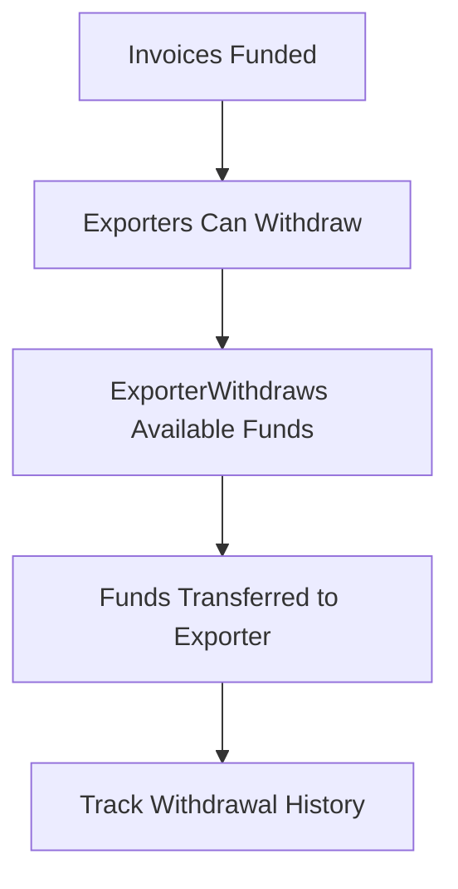
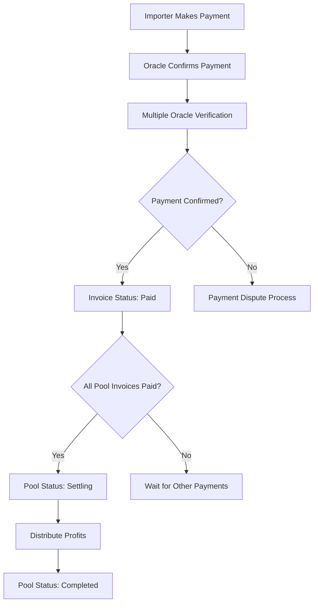
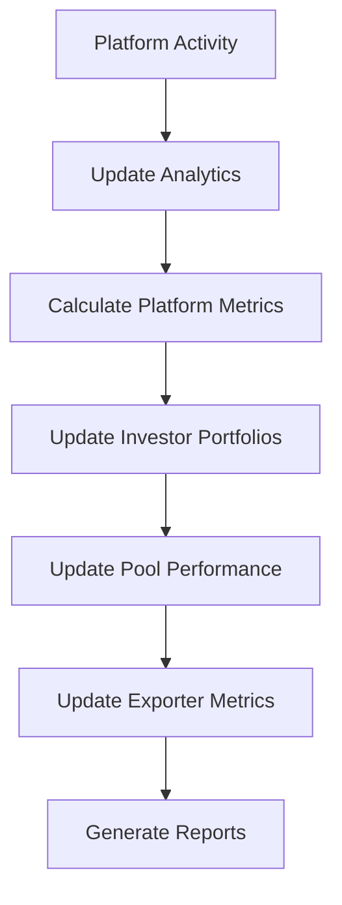

# Export-Import Funding Platform - Business Process Flow & Frontend Integration Guide

## Table of Contents

1. [Overview](#overview)
2. [Core Business Process Flow](#core-business-process-flow)
3. [Smart Contract Architecture](#smart-contract-architecture)
4. [Frontend Integration Methods](#frontend-integration-methods)
5. [Role-Based Workflows](#role-based-workflows)
6. [Event Listening & Real-time Updates](#event-listening--real-time-updates)
7. [Error Handling](#error-handling)
8. [Security Considerations](#security-considerations)

## Overview

The Export-Import Funding Platform is a blockchain-based system that facilitates trade financing by connecting exporters, investors, and importers through smart contracts. The platform tokenizes shipping invoices as NFTs, pools them for investment, and manages automated settlement processes.

### Key Stakeholders
- **Platform Admin**: Manages the platform, grants roles, manages pools
- **Exporters**: Submit invoices, withdraw funds after funding
- **Investors**: Invest in pools, earn returns on successful settlements
- **Importers**: Pay invoices through oracle-verified payment systems

## Core Business Process Flow

### Phase 1: Invoice Creation & Submission


**Smart Contracts Involved**: `InvoiceNFT`, `AccessControl`

**Methods Called**:
1. `InvoiceNFT.mintInvoice()` - Create new invoice
2. `InvoiceNFT.finalizeInvoice()` - Make invoice available for pooling

### Phase 2: Pool Creation & Management


**Smart Contracts Involved**: `PoolNFT`, `AccessControl`

**Methods Called**:
1. `PoolNFT.createPool()` - Create investment pool with invoices
2. `PoolNFT.addInvoicesToPool()` - Add additional invoices (optional)
3. `PoolNFT.finalizePool()` - Open pool for investment

### Phase 3: Investment & Funding


**Smart Contracts Involved**: `PoolFundingManager`, `InvoiceNFT`, `PoolNFT`

**Methods Called**:
1. `PoolFundingManager.investInPool()` - Make investment
2. `PoolFundingManager.allocateFundsToInvoices()` - Distribute funds to invoices
3. `PoolNFT.markPoolFunded()` - Update pool status

### Phase 4: Fund Withdrawal


**Smart Contracts Involved**: `InvoiceNFT`

**Methods Called**:
1. `InvoiceNFT.withdrawFunds()` - Withdraw available funding
2. `InvoiceNFT.getAvailableWithdrawal()` - Check available amount

### Phase 5: Payment & Settlement


**Smart Contracts Involved**: `PaymentOracle`, `InvoiceNFT`, `PoolNFT`, `PoolFundingManager`

**Methods Called**:
1. `PaymentOracle.submitPaymentConfirmation()` - Oracle confirms payment
2. `InvoiceNFT.markInvoicePaid()` - Update invoice status
3. `PoolNFT.markPoolSettling()` - Start settlement process
4. `PoolFundingManager.distributeProfits()` - Calculate and distribute profits
5. `PoolFundingManager.claimInvestorReturns()` - Investors claim returns

### Phase 6: Analytics & Reporting


**Smart Contracts Involved**: `PlatformAnalytics`

**Methods Called**:
1. `PlatformAnalytics.updatePlatformMetrics()` - Update platform statistics
2. `PlatformAnalytics.updateInvestorPortfolio()` - Update investor data
3. `PlatformAnalytics.updatePoolPerformance()` - Update pool metrics

## Smart Contract Architecture

### Contract Relationships
```
AccessControl (Core)
    ├── InvoiceNFT (Depends on AccessControl)
    ├── PoolNFT (Depends on AccessControl + InvoiceNFT)
    ├── PoolFundingManager (Depends on AccessControl + InvoiceNFT + PoolNFT)
    ├── PaymentOracle (Depends on all above)
    └── PlatformAnalytics (Depends on all above)
```

### Key Constants
- **Minimum Investment**: 1,000 tokens (1000e18)
- **Maximum Investment per Pool**: 1,000,000 tokens (1000000e18)
- **Platform Fee**: 1% (100 basis points)
- **Investor Yield**: 4% (400 basis points)
- **Minimum Funding Threshold**: 70% (7000 basis points)
- **Oracle Confirmation Required**: 2 confirmations

## Frontend Integration Methods

### 1. Access Control Management

#### Grant Roles
```javascript
// Grant exporter role to a user
const grantExporterRole = async (userAddress) => {
    const tx = await accessControlContract.grantExporterRole(userAddress);
    await tx.wait();
    return tx.hash;
};

// Grant investor role to a user  
const grantInvestorRole = async (userAddress) => {
    const tx = await accessControlContract.grantInvestorRole(userAddress);
    await tx.wait();
    return tx.hash;
};
```

**Function**: `grantExporterRole(address account)`
- **Description**: Grants exporter role to an address, allowing them to create invoices
- **Access**: Admin only
- **Parameters**: 
  - `account` (address): Address to grant exporter role

**Function**: `grantInvestorRole(address account)`
- **Description**: Grants investor role to an address, allowing them to invest in pools
- **Access**: Admin only
- **Parameters**:
  - `account` (address): Address to grant investor role

#### Check User Roles
```javascript
// Check if user has specific roles
const checkUserRoles = async (userAddress) => {
    const [isAdmin, isExporter, isInvestor] = await accessControlContract.getUserRoles(userAddress);
    return { isAdmin, isExporter, isInvestor };
};
```

**Function**: `getUserRoles(address account)`
- **Description**: Returns all roles for a specific address
- **Access**: Public view
- **Parameters**:
  - `account` (address): Address to check roles for
- **Returns**: 
  - `hasAdminRole` (bool): Whether address has admin role
  - `hasExporterRole` (bool): Whether address has exporter role  
  - `hasInvestorRole` (bool): Whether address has investor role

### 2. Invoice Management

#### Create Invoice
```javascript
// Create a new shipping invoice
const createInvoice = async (invoiceData) => {
    const {
        exporterCompany,
        importerCompany, 
        shippingAmount,
        loanAmount,
        shippingDate
    } = invoiceData;
    
    const tx = await invoiceNFTContract.mintInvoice(
        exporterCompany,
        importerCompany,
        ethers.parseEther(shippingAmount.toString()),
        ethers.parseEther(loanAmount.toString()),
        Math.floor(shippingDate.getTime() / 1000)
    );
    
    const receipt = await tx.wait();
    const invoiceId = receipt.logs[0].args[0]; // Get invoice ID from event
    
    return { transactionHash: tx.hash, invoiceId };
};
```

**Function**: `mintInvoice(string exporterCompany, string importerCompany, uint256 shippingAmount, uint256 loanAmount, uint256 shippingDate)`
- **Description**: Creates and mints a new invoice NFT
- **Access**: Exporters only
- **Parameters**:
  - `exporterCompany` (string): Name of exporter company
  - `importerCompany` (string): Name of importer company
  - `shippingAmount` (uint256): Total shipping/invoice amount in wei
  - `loanAmount` (uint256): Requested loan amount in wei (≤ shipping amount)
  - `shippingDate` (uint256): Unix timestamp of shipping date
- **Returns**: `invoiceId` (uint256): The minted invoice NFT ID

#### Finalize Invoice
```javascript
// Finalize invoice to make it available for pooling
const finalizeInvoice = async (invoiceId) => {
    const tx = await invoiceNFTContract.finalizeInvoice(invoiceId);
    await tx.wait();
    return tx.hash;
};
```

**Function**: `finalizeInvoice(uint256 invoiceId)`
- **Description**: Finalizes an invoice to make it ready for pool inclusion
- **Access**: Invoice owner (exporter) only
- **Parameters**:
  - `invoiceId` (uint256): ID of the invoice to finalize

#### Get Invoice Details
```javascript
// Fetch complete invoice information
const getInvoice = async (invoiceId) => {
    const invoice = await invoiceNFTContract.getInvoice(invoiceId);
    return {
        exporterWallet: invoice.exporterWallet,
        status: invoice.status, // 0=Pending, 1=Finalized, 2=Fundraising, 3=Funded, 4=Paid, 5=Cancelled
        shippingAmount: ethers.formatEther(invoice.shippingAmount),
        loanAmount: ethers.formatEther(invoice.loanAmount),
        amountInvested: ethers.formatEther(invoice.amountInvested),
        amountWithdrawn: ethers.formatEther(invoice.amountWithdrawn),
        shippingDate: new Date(invoice.shippingDate * 1000),
        createdAt: new Date(invoice.createdAt * 1000),
        exporterCompany: invoice.exporterCompany,
        importerCompany: invoice.importerCompany
    };
};
```

**Function**: `getInvoice(uint256 invoiceId)`
- **Description**: Returns complete invoice details
- **Access**: Public view
- **Parameters**:
  - `invoiceId` (uint256): ID of the invoice
- **Returns**: Complete `Invoice` struct with all fields

#### Get Invoices by Exporter
```javascript
// Get all invoices for a specific exporter
const getExporterInvoices = async (exporterAddress) => {
    const invoiceIds = await invoiceNFTContract.getInvoicesByExporter(exporterAddress);
    
    const invoices = await Promise.all(
        invoiceIds.map(async (id) => {
            const invoice = await getInvoice(id);
            return { id, ...invoice };
        })
    );
    
    return invoices;
};
```

**Function**: `getInvoicesByExporter(address exporter)`
- **Description**: Returns array of invoice IDs owned by a specific exporter
- **Access**: Public view
- **Parameters**:
  - `exporter` (address): Exporter address
- **Returns**: `invoiceIds` (uint256[]): Array of invoice IDs

#### Withdraw Funds
```javascript
// Withdraw available funds from an invoice
const withdrawFunds = async (invoiceId, amount = 0) => {
    // amount = 0 means withdraw all available
    const tx = await invoiceNFTContract.withdrawFunds(invoiceId, ethers.parseEther(amount.toString()));
    await tx.wait();
    return tx.hash;
};
```

**Function**: `withdrawFunds(uint256 invoiceId, uint256 amount)`
- **Description**: Withdraws available funds from a funded invoice
- **Access**: Invoice owner (exporter) only
- **Parameters**:
  - `invoiceId` (uint256): ID of the invoice
  - `amount` (uint256): Amount to withdraw in wei (0 = withdraw all available)

### 3. Pool Management

#### Create Pool
```javascript
// Create a new investment pool
const createPool = async (poolName, invoiceIds) => {
    const tx = await poolNFTContract.createPool(poolName, invoiceIds);
    const receipt = await tx.wait();
    const poolId = receipt.logs[0].args[0]; // Get pool ID from event
    
    return { transactionHash: tx.hash, poolId };
};
```

**Function**: `createPool(string name, uint256[] invoiceIds)`
- **Description**: Creates a new investment pool with selected invoices
- **Access**: Admin only
- **Parameters**:
  - `name` (string): Pool name/description
  - `invoiceIds` (uint256[]): Array of finalized invoice IDs (max 50)
- **Returns**: `poolId` (uint256): The created pool NFT ID

#### Finalize Pool for Fundraising
```javascript
// Open pool for investor funding
const finalizePoolForFunding = async (poolId) => {
    const tx = await poolNFTContract.finalizePool(poolId);
    await tx.wait();
    return tx.hash;
};
```

**Function**: `finalizePool(uint256 poolId)`
- **Description**: Finalizes pool to start accepting investor funding
- **Access**: Admin only
- **Parameters**:
  - `poolId` (uint256): ID of the pool to finalize

#### Get Pool Details
```javascript
// Fetch complete pool information
const getPool = async (poolId) => {
    const pool = await poolNFTContract.getPool(poolId);
    return {
        creator: pool.creator,
        status: pool.status, // 0=Open, 1=Fundraising, 2=Funded, 3=Settling, 4=Completed
        invoiceCount: pool.invoiceCount,
        totalLoanAmount: ethers.formatEther(pool.totalLoanAmount),
        totalShippingAmount: ethers.formatEther(pool.totalShippingAmount),
        totalInvested: ethers.formatEther(pool.totalInvested),
        totalDistributed: ethers.formatEther(pool.totalDistributed),
        createdAt: new Date(pool.createdAt * 1000),
        fundedAt: pool.fundedAt > 0 ? new Date(pool.fundedAt * 1000) : null,
        name: pool.name,
        invoiceIds: pool.invoiceIds
    };
};
```

**Function**: `getPool(uint256 poolId)`
- **Description**: Returns complete pool details
- **Access**: Public view
- **Parameters**:
  - `poolId` (uint256): ID of the pool
- **Returns**: Complete `Pool` struct with all fields

#### Get Pools by Status
```javascript
// Get all pools with specific status
const getPoolsByStatus = async (status) => {
    // status: 0=Open, 1=Fundraising, 2=Funded, 3=Settling, 4=Completed
    const poolIds = await poolNFTContract.getPoolsByStatus(status);
    
    const pools = await Promise.all(
        poolIds.map(async (id) => {
            const pool = await getPool(id);
            return { id, ...pool };
        })
    );
    
    return pools;
};
```

**Function**: `getPoolsByStatus(PoolStatus status)`
- **Description**: Returns array of pool IDs with the specified status
- **Access**: Public view
- **Parameters**:
  - `status` (uint8): Pool status (0-4)
- **Returns**: `poolIds` (uint256[]): Array of pool IDs

### 4. Investment & Funding

#### Invest in Pool
```javascript
// Make an investment in a fundraising pool
const investInPool = async (poolId, amount) => {
    const tx = await poolFundingManagerContract.investInPool(
        poolId, 
        ethers.parseEther(amount.toString())
    );
    await tx.wait();
    return tx.hash;
};
```

**Function**: `investInPool(uint256 poolId, uint256 amount)`
- **Description**: Allows investors to invest in a fundraising pool
- **Access**: Investors only
- **Parameters**:
  - `poolId` (uint256): ID of the pool to invest in
  - `amount` (uint256): Investment amount in wei (min: 1,000 tokens, max: 1,000,000 tokens per pool)

#### Allocate Funds to Invoices
```javascript
// Admin allocates pool funds to invoices (70% threshold reached)
const allocateFundsToInvoices = async (poolId) => {
    const tx = await poolFundingManagerContract.allocateFundsToInvoices(poolId);
    await tx.wait();
    return tx.hash;
};
```

**Function**: `allocateFundsToInvoices(uint256 poolId)`
- **Description**: Allocates invested pool funds proportionally to invoices
- **Access**: Admin only
- **Parameters**:
  - `poolId` (uint256): ID of the pool with sufficient funding (≥70%)

#### Get Investment Info
```javascript
// Get investor's investment details for a specific pool
const getInvestorPoolInfo = async (investorAddress, poolId) => {
    const info = await poolFundingManagerContract.getInvestorPoolInfo(investorAddress, poolId);
    return {
        investment: ethers.formatEther(info.investment),
        canClaim: info.canClaim,
        estimatedReturn: ethers.formatEther(info.estimatedReturn)
    };
};
```

**Function**: `getInvestorPoolInfo(address investor, uint256 poolId)`
- **Description**: Returns investment details for a specific investor in a pool
- **Access**: Public view
- **Parameters**:
  - `investor` (address): Address of the investor
  - `poolId` (uint256): ID of the pool
- **Returns**:
  - `investment` (uint256): Amount invested
  - `canClaim` (bool): Whether returns can be claimed
  - `estimatedReturn` (uint256): Estimated total return (principal + rewards)

#### Get Pool Funding Statistics
```javascript
// Get funding progress and statistics for a pool
const getPoolFundingStats = async (poolId) => {
    const stats = await poolFundingManagerContract.getPoolFundingStats(poolId);
    return {
        totalInvested: ethers.formatEther(stats.totalInvested),
        investorCount: stats.investorCount.toString(),
        fundingProgress: (stats.fundingProgress / 100).toString() + '%' // Convert from basis points
    };
};
```

**Function**: `getPoolFundingStats(uint256 poolId)`
- **Description**: Returns funding statistics for a pool
- **Access**: Public view
- **Parameters**:
  - `poolId` (uint256): ID of the pool
- **Returns**:
  - `totalInvested` (uint256): Total amount invested
  - `investorCount` (uint256): Number of unique investors
  - `fundingProgress` (uint256): Percentage of target funding reached (basis points)

#### Claim Investor Returns
```javascript
// Claim returns from a completed pool
const claimInvestorReturns = async (poolId) => {
    const tx = await poolFundingManagerContract.claimInvestorReturns(poolId);
    await tx.wait();
    return tx.hash;
};
```

**Function**: `claimInvestorReturns(uint256 poolId)`
- **Description**: Allows investors to claim their returns from a completed pool
- **Access**: Investors only (must have investment in the pool)
- **Parameters**:
  - `poolId` (uint256): ID of the completed pool

### 5. Payment Oracle & Settlement

#### Submit Payment Confirmation (Oracle)
```javascript
// Oracle submits payment confirmation
const submitPaymentConfirmation = async (invoiceId, paymentHash, amountPaid) => {
    const tx = await paymentOracleContract.submitPaymentConfirmation(
        invoiceId,
        paymentHash,
        ethers.parseEther(amountPaid.toString())
    );
    await tx.wait();
    return tx.hash;
};
```

**Function**: `submitPaymentConfirmation(uint256 invoiceId, bytes32 paymentHash, uint256 amountPaid)`
- **Description**: Submits payment confirmation for an invoice (oracle only)
- **Access**: Authorized oracles only
- **Parameters**:
  - `invoiceId` (uint256): ID of the paid invoice
  - `paymentHash` (bytes32): Hash of the payment transaction/proof
  - `amountPaid` (uint256): Amount paid for the invoice in wei

#### Authorize Oracle
```javascript
// Admin authorizes a new oracle
const authorizeOracle = async (oracleAddress) => {
    const tx = await paymentOracleContract.authorizeOracle(oracleAddress);
    await tx.wait();
    return tx.hash;
};
```

**Function**: `authorizeOracle(address oracle)`
- **Description**: Authorizes an oracle to submit payment confirmations
- **Access**: Admin only
- **Parameters**:
  - `oracle` (address): Address of the oracle to authorize

#### Get Payment Record
```javascript
// Get payment confirmation details for an invoice
const getPaymentRecord = async (invoiceId) => {
    const record = await paymentOracleContract.getPaymentRecord(invoiceId);
    return {
        amountPaid: ethers.formatEther(record.amountPaid),
        paymentTimestamp: new Date(record.paymentTimestamp * 1000),
        paymentHash: record.paymentHash,
        confirmationCount: record.confirmationCount.toString(),
        isConfirmed: record.isConfirmed,
        isDisputed: record.isDisputed,
        disputeDeadline: new Date(record.disputeDeadline * 1000)
    };
};
```

**Function**: `getPaymentRecord(uint256 invoiceId)`
- **Description**: Returns payment record details for an invoice
- **Access**: Public view
- **Parameters**:
  - `invoiceId` (uint256): ID of the invoice
- **Returns**: Complete `PaymentRecord` struct with confirmation details

#### Distribute Profits
```javascript
// Admin distributes profits after pool completion
const distributeProfits = async (poolId) => {
    const tx = await poolFundingManagerContract.distributeProfits(poolId);
    await tx.wait();
    return tx.hash;
};
```

**Function**: `distributeProfits(uint256 poolId)`
- **Description**: Distributes profits to investors and platform after pool completion
- **Access**: Admin only
- **Parameters**:
  - `poolId` (uint256): ID of the completed pool (all invoices paid)

### 6. Analytics & Reporting

#### Update Platform Metrics
```javascript
// Update platform-wide analytics
const updatePlatformMetrics = async () => {
    const tx = await platformAnalyticsContract.updatePlatformMetrics();
    await tx.wait();
    return tx.hash;
};
```

**Function**: `updatePlatformMetrics()`
- **Description**: Updates platform-wide statistics and metrics
- **Access**: Admin only

#### Get Platform Statistics
```javascript
// Get comprehensive platform statistics
const getPlatformStats = async () => {
    const metrics = await platformAnalyticsContract.getPlatformMetrics();
    return {
        totalInvoicesCreated: metrics.totalInvoicesCreated.toString(),
        totalPoolsCreated: metrics.totalPoolsCreated.toString(),
        totalValueLocked: ethers.formatEther(metrics.totalValueLocked),
        totalValueProcessed: ethers.formatEther(metrics.totalValueProcessed),
        totalPlatformFees: ethers.formatEther(metrics.totalPlatformFees),
        totalInvestorReturns: ethers.formatEther(metrics.totalInvestorReturns),
        activeInvoices: metrics.activeInvoices.toString(),
        activePools: metrics.activePools.toString(),
        uniqueInvestors: metrics.uniqueInvestors.toString(),
        uniqueExporters: metrics.uniqueExporters.toString(),
        completedInvoices: metrics.completedInvoices.toString()
    };
};
```

**Function**: `getPlatformMetrics()`
- **Description**: Returns comprehensive platform statistics
- **Access**: Public view
- **Returns**: Complete `PlatformMetrics` struct with all platform statistics

#### Update Investor Portfolio
```javascript
// Update analytics for a specific investor
const updateInvestorPortfolio = async (investorAddress) => {
    const tx = await platformAnalyticsContract.updateInvestorPortfolio(investorAddress);
    await tx.wait();
    return tx.hash;
};
```

**Function**: `updateInvestorPortfolio(address investor)`
- **Description**: Updates portfolio metrics for a specific investor
- **Access**: Anyone can call for any investor
- **Parameters**:
  - `investor` (address): Address of the investor to update

#### Get Investor Portfolio
```javascript
// Get investor portfolio analytics
const getInvestorPortfolio = async (investorAddress) => {
    const portfolio = await platformAnalyticsContract.getInvestorPortfolio(investorAddress);
    return {
        totalInvested: ethers.formatEther(portfolio.totalInvested),
        totalReturns: ethers.formatEther(portfolio.totalReturns),
        activeInvestments: ethers.formatEther(portfolio.activeInvestments),
        completedInvestments: portfolio.completedInvestments.toString(),
        averageRoi: (portfolio.averageRoi / 100).toString() + '%', // Convert from basis points
        totalPoolsInvested: portfolio.totalPoolsInvested.toString(),
        lastInvestmentTimestamp: new Date(portfolio.lastInvestmentTimestamp * 1000),
        riskScore: (portfolio.riskScore / 100).toString() + '%' // Convert from basis points
    };
};
```

**Function**: `getInvestorPortfolio(address investor)`
- **Description**: Returns complete investor portfolio metrics
- **Access**: Public view
- **Parameters**:
  - `investor` (address): Address of the investor
- **Returns**: Complete `InvestorPortfolio` struct with all metrics

## Role-Based Workflows

### Admin Workflow
1. **Setup Phase**:
   - Grant roles to users (`grantExporterRole`, `grantInvestorRole`)
   - Authorize payment oracles (`authorizeOracle`)

2. **Pool Management**:
   - Create pools with finalized invoices (`createPool`)
   - Finalize pools for fundraising (`finalizePool`)
   - Allocate funds when threshold reached (`allocateFundsToInvoices`)

3. **Settlement**:
   - Distribute profits after completion (`distributeProfits`)
   - Handle disputes (`disputePayment`, `resolvePaymentDispute`)

4. **Analytics**:
   - Update platform metrics (`updatePlatformMetrics`)
   - Generate reports

### Exporter Workflow
1. **Invoice Management**:
   - Create invoices (`mintInvoice`)
   - Finalize invoices (`finalizeInvoice`)
   - Monitor pool inclusion

2. **Fund Management**:
   - Check available withdrawals (`getAvailableWithdrawal`)
   - Withdraw funds (`withdrawFunds`)
   - Monitor payment status

### Investor Workflow
1. **Investment**:
   - Browse available pools (`getPoolsByStatus`)
   - Check pool details and risk (`getPool`, `getPoolFundingStats`)
   - Make investments (`investInPool`)

2. **Portfolio Management**:
   - Monitor investments (`getInvestorPoolInfo`)
   - Track portfolio performance (`getInvestorPortfolio`)
   - Claim returns (`claimInvestorReturns`)

### Oracle Workflow
1. **Payment Verification**:
   - Monitor payment systems
   - Submit confirmations (`submitPaymentConfirmation`)
   - Handle disputes

## Event Listening & Real-time Updates

### Key Events to Monitor

#### Invoice Events
```javascript
// Listen for new invoices
invoiceNFTContract.on("InvoiceMinted", (invoiceId, exporter, exporterCompany, importerCompany, shippingAmount, loanAmount, shippingDate) => {
    console.log(`New invoice ${invoiceId} created by ${exporter}`);
    // Update UI with new invoice
});

// Listen for status changes
invoiceNFTContract.on("InvoiceStatusUpdated", (invoiceId, previousStatus, newStatus) => {
    console.log(`Invoice ${invoiceId} status changed from ${previousStatus} to ${newStatus}`);
    // Update invoice display
});

// Listen for funding events
invoiceNFTContract.on("InvoiceFunded", (invoiceId, amount, totalInvested) => {
    console.log(`Invoice ${invoiceId} received ${ethers.formatEther(amount)} funding`);
    // Update funding progress
});
```

#### Pool Events
```javascript
// Listen for new pools
poolNFTContract.on("PoolCreated", (poolId, creator, name, timestamp) => {
    console.log(`New pool ${poolId} "${name}" created by ${creator}`);
    // Update pool list
});

// Listen for pool status changes
poolNFTContract.on("PoolStatusUpdated", (poolId, previousStatus, newStatus) => {
    console.log(`Pool ${poolId} status changed from ${previousStatus} to ${newStatus}`);
    // Update pool status display
});

// Listen for pool funding
poolNFTContract.on("PoolFunded", (poolId, totalInvested, timestamp) => {
    console.log(`Pool ${poolId} fully funded with ${ethers.formatEther(totalInvested)}`);
    // Update pool status
});
```

#### Investment Events
```javascript
// Listen for new investments
poolFundingManagerContract.on("InvestmentMade", (investor, poolId, amount, timestamp) => {
    console.log(`${investor} invested ${ethers.formatEther(amount)} in pool ${poolId}`);
    // Update investment tracking
});

// Listen for profit distributions
poolFundingManagerContract.on("ProfitsDistributed", (poolId, platformFee, investorRewards, timestamp) => {
    console.log(`Profits distributed for pool ${poolId}`);
    // Update investor balances
});
```

#### Payment Events
```javascript
// Listen for payment confirmations
paymentOracleContract.on("PaymentConfirmed", (invoiceId, paymentHash, amount, timestamp) => {
    console.log(`Payment confirmed for invoice ${invoiceId}: ${ethers.formatEther(amount)}`);
    // Update payment status
});

// Listen for settlement triggers
paymentOracleContract.on("PoolSettlementTriggered", (poolId, totalPaid, timestamp) => {
    console.log(`Pool ${poolId} settlement triggered with total payment ${ethers.formatEther(totalPaid)}`);
    // Update settlement status
});
```

## Error Handling

### Common Error Types

#### Access Control Errors
```javascript
try {
    await contract.adminOnlyFunction();
} catch (error) {
    if (error.message.includes("NotAdmin")) {
        throw new Error("Access denied: Admin role required");
    }
    if (error.message.includes("NotExporter")) {
        throw new Error("Access denied: Exporter role required");
    }
    if (error.message.includes("NotInvestor")) {
        throw new Error("Access denied: Investor role required");
    }
}
```

#### Validation Errors
```javascript
try {
    await contract.someFunction(params);
} catch (error) {
    if (error.message.includes("InvalidAmount")) {
        throw new Error("Invalid amount provided");
    }
    if (error.message.includes("InvalidAddress")) {
        throw new Error("Invalid address provided");
    }
    if (error.message.includes("InvalidInvoiceId")) {
        throw new Error("Invoice not found");
    }
}
```

#### Business Logic Errors
```javascript
try {
    await contract.investInPool(poolId, amount);
} catch (error) {
    if (error.message.includes("PoolNotFundraising")) {
        throw new Error("Pool is not accepting investments");
    }
    if (error.message.includes("InvestmentTooSmall")) {
        throw new Error("Investment amount below minimum (1,000 tokens)");
    }
    if (error.message.includes("ExceedsMaxInvestment")) {
        throw new Error("Investment exceeds maximum per pool (1,000,000 tokens)");
    }
}
```

## Security Considerations

### Frontend Security Best Practices

1. **Input Validation**:
   - Validate all user inputs before sending to contracts
   - Check address formats, amount ranges, and data types
   - Sanitize string inputs for company names

2. **Transaction Safety**:
   - Always check user balances before transactions
   - Implement proper gas estimation
   - Use transaction confirmations and error handling

3. **Role Verification**:
   - Verify user roles before showing relevant UI elements
   - Cache role information and refresh periodically
   - Handle role changes gracefully

4. **State Management**:
   - Keep UI state synchronized with blockchain state
   - Handle pending transactions appropriately
   - Implement proper loading and error states

### Example Security Implementation
```javascript
// Comprehensive transaction wrapper with security checks
const secureTransaction = async (contractFunction, userAddress, requiredRole = null) => {
    try {
        // Check user role if required
        if (requiredRole) {
            const roles = await checkUserRoles(userAddress);
            if (!roles[requiredRole]) {
                throw new Error(`Access denied: ${requiredRole} role required`);
            }
        }
        
        // Estimate gas
        const gasEstimate = await contractFunction.estimateGas();
        const gasLimit = gasEstimate * BigInt(120) / BigInt(100); // 20% buffer
        
        // Execute transaction
        const tx = await contractFunction({ gasLimit });
        
        // Wait for confirmation
        const receipt = await tx.wait(1); // Wait for 1 confirmation
        
        return {
            success: true,
            transactionHash: tx.hash,
            gasUsed: receipt.gasUsed.toString()
        };
        
    } catch (error) {
        console.error("Transaction failed:", error);
        return {
            success: false,
            error: error.message
        };
    }
};

// Usage example
const result = await secureTransaction(
    () => invoiceNFTContract.mintInvoice(...params),
    userAddress,
    'isExporter'
);

if (result.success) {
    console.log("Transaction successful:", result.transactionHash);
} else {
    console.error("Transaction failed:", result.error);
}
```

This comprehensive documentation provides frontend developers with all necessary information to integrate with the export-import funding platform smart contracts, including detailed method descriptions, parameter explanations, workflow guidance, and security best practices.