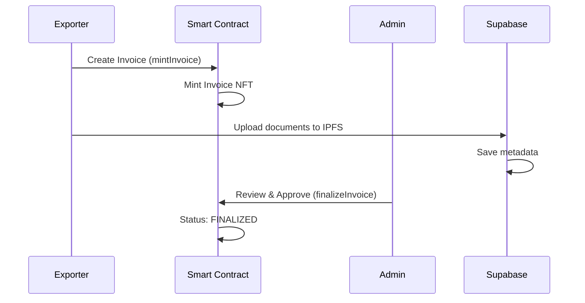
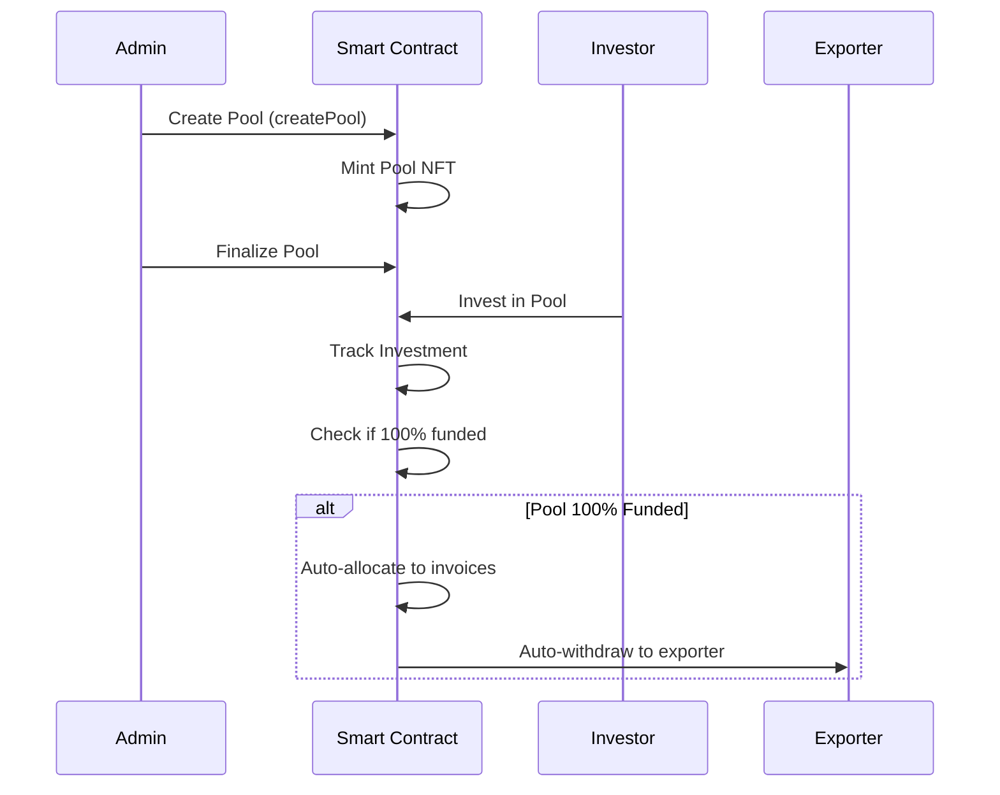
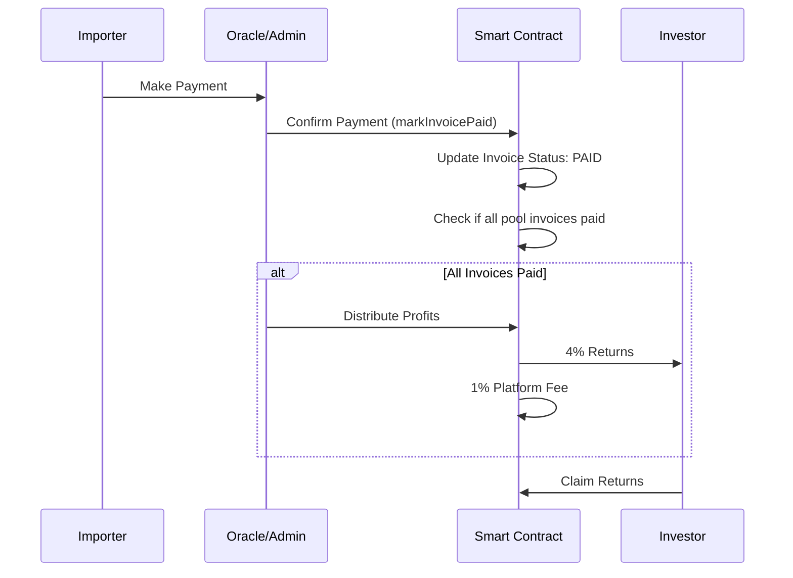

# SEATrax - Shipping Invoice Funding Platform

> 🌊 **Shipping Excellence Across Borders** - Blockchain-based trade finance platform connecting exporters, investors, and administrators

[](https://nextjs.org/)
[](https://www.typescriptlang.org/)
[](https://sepolia.lisk.com/)

---

## 📖 Table of Contents

- [Overview](#-overview)
- [Key Features](#-key-features)
- [Technology Stack](#-technology-stack)
- [User Roles](#-user-roles)
- [Application Flow](#-application-flow)
- [Getting Started](#-getting-started)
- [Project Structure](#-project-structure)
- [Environment Configuration](#-environment-configuration)
- [Development](#-development)
- [Deployment](#-deployment)
- [Documentation](#-documentation)

---

## 🌊 Overview

SEATrax is a **blockchain platform** that revolutionizes trade finance by tokenizing shipping invoices as NFTs and enabling decentralized funding through investor pools. The platform provides a secure, transparent, and efficient way for exporters to access immediate liquidity while offering investors attractive returns on trade finance investments.

### How It Works

1. **Exporters** submit shipping invoices and receive up to 70-100% advance funding
2. **Investors** browse curated invoice pools and invest to earn 4% returns
3. **Admin** verifies exporters, approves invoices, and manages investment pools
4. **Smart Contracts** automate fund distribution, payments, and profit sharing
5. **Blockchain** ensures transparency, immutability, and trust

---

## ✨ Key Features

### For Exporters
- ✅ **Invoice Tokenization**: Convert shipping invoices into NFTs
- ✅ **Instant Liquidity**: Access funds when invoices reach 70% funding
- ✅ **Document Storage**: Secure IPFS-based document management via Pinata
- ✅ **Real-time Tracking**: Monitor funding progress and payment status
- ✅ **Automatic Withdrawal**: Seamless fund withdrawal to wallet

### For Investors
- ✅ **Curated Pools**: Browse admin-verified investment opportunities
- ✅ **Risk Assessment**: View pool risk categories and invoice details
- ✅ **Guaranteed Returns**: Earn 4% yield on successful settlements
- ✅ **Portfolio Tracking**: Monitor active investments and claimed returns
- ✅ **Transparent Metrics**: Real-time pool performance analytics

### For Administrators
- ✅ **User Verification**: Approve exporter applications with KYC data
- ✅ **Invoice Review**: Validate and approve submitted invoices
- ✅ **Pool Creation**: Curate invoice pools for investor funding
- ✅ **Payment Confirmation**: Verify importer payments via oracle
- ✅ **Platform Analytics**: Monitor platform-wide metrics and performance

### Technical Features
- ✅ **Multi-Contract Architecture**: 6 specialized smart contracts on Lisk Sepolia
- ✅ **Hybrid Sync System**: Smart contract authority + Supabase metadata
- ✅ **Responsive Design**: Mobile-first UI with adaptive components
- ✅ **Error Handling**: Comprehensive error boundaries and recovery
- ✅ **Security**: Production-grade headers, env validation, role guards
- ✅ **Real-time Conversion**: USD ↔ ETH via CurrencyFreaks API

---


## 🛠️ Technology Stack

### Frontend
- **Framework**: [Next.js 15](https://nextjs.org/) with App Router
- **Language**: [TypeScript 5](https://www.typescriptlang.org/)
- **Styling**: [Tailwind CSS 4](https://tailwindcss.com/)
- **UI Components**: [shadcn/ui](https://ui.shadcn.com/) (Radix UI primitives)
- **Icons**: [Lucide React](https://lucide.dev/)
- **State Management**: React Hooks & Context

### Blockchain
- **Network**: [Lisk Sepolia Testnet](https://sepolia.lisk.com/)
- **Wallet Integration**: [Panna SDK](https://panna.io/)
- **Smart Contract Interaction**: [Thirdweb SDK](https://thirdweb.com/)
- **Smart Contracts**: 6 specialized contracts
  - **Repository**: [github.com/SEATrax/smart-contract](https://github.com/SEATrax/smart-contract)
  - **AccessControl**: [0x6dA6C2...7bA2F](https://sepolia-blockscout.lisk.com/address/0x6dA6C2Afcf8f2a1F31fC0eCc4C037C0b6317bA2F)
  - **InvoiceNFT**: [0x8Da2dF...d69E16](https://sepolia-blockscout.lisk.com/address/0x8Da2dF6050158ae8B058b90B37851323eFd69E16)
  - **PoolNFT**: [0x317Ce2...0775ad](https://sepolia-blockscout.lisk.com/address/0x317Ce254731655E19932b9EFEAf7eeA31F0775ad)
  - **PoolFundingManager**: [0xbD5f29...9ff45C](https://sepolia-blockscout.lisk.com/address/0xbD5f292F75D22996E7A4DD277083c75aB29ff45C)
  - **PaymentOracle**: [0x789472...659296a8](https://sepolia-blockscout.lisk.com/address/0x7894728174E53Df9Fec402De07d80652659296a8)
  - **PlatformAnalytics**: [0xb77C5C...ED987A9](https://sepolia-blockscout.lisk.com/address/0xb77C5C42b93ec46A323137B64586F0F8dED987A9)

### Backend & Storage
- **Database**: [Supabase](https://supabase.com/) (PostgreSQL)
- **File Storage**: [Pinata](https://pinata.cloud/) (IPFS)
- **Currency API**: [CurrencyFreaks](https://currencyfreaks.com/) (USD ↔ ETH)

### Development Tools
- **Package Manager**: npm
- **Linting**: ESLint
- **Type Checking**: TypeScript Compiler
- **Build Tool**: Next.js

---

## 👥 User Roles

### 🏭 Exporter
**Registration**: Complete onboarding with company details (name, tax ID, country, export license)

**Capabilities**:
- Create shipping invoices with IPFS document upload
- Track invoice funding progress in real-time
- Withdraw funds when invoices reach ≥70% funding
- Monitor payment status from importers
- View payment history and transaction details

**Workflow**:
```
Register → Create Invoice → Wait for Approval → Track Funding → Withdraw Funds → Payment Settlement
```

### 💼 Investor
**Registration**: Complete onboarding with personal details (name, address)

**Capabilities**:
- Browse curated investment pools with risk assessment
- View detailed invoice breakdown per pool
- Invest in pools (minimum 1000 tokens)
- Track active investments and portfolio performance
- Claim returns (4% yield) after invoice payments

**Workflow**:
```
Register → Browse Pools → Invest → Monitor Progress → Claim Returns
```

### 🔐 Admin
**Access**: Determined by wallet address in `ADMIN_ADDRESSES` environment variable

**Capabilities**:
- Verify exporter applications and grant roles
- Review and approve/reject submitted invoices
- Create investment pools from finalized invoices
- Allocate funds to invoices (≥70% pool funding)
- Confirm importer payments via oracle integration
- Distribute profits to investors after settlements
- Monitor platform-wide analytics and metrics

**Workflow**:
```
Verify Exporters → Approve Invoices → Create Pools → Manage Funding → Confirm Payments → Distribute Profits
```

---

## 🔄 Application Flow

### 1️⃣ Invoice Creation & Approval


### 2️⃣ Pool Creation & Investment


### 3️⃣ Payment & Settlement


### Business Rules
- **Funding Threshold**: Exporters can withdraw at ≥70% invoice funding
- **Auto-Distribution**: Funds automatically sent to exporters at 100% pool funding
- **Profit Distribution**: 4% to investors, 1% platform fee, remainder to exporters
- **Minimum Investment**: 1000 tokens per investor per pool

---

## � Getting Started

### Prerequisites

Before starting, ensure you have:
- ✅ **Node.js 18+** installed ([Download](https://nodejs.org/))
- ✅ **npm** or **yarn** package manager
- ✅ **Wallet** (MetaMask or compatible EVM wallet)
- ✅ **Lisk Sepolia ETH** ([Get from faucet](https://sepolia-faucet.lisk.com/))

### Quick Setup (5 minutes)

#### 1. Clone the Repository
```bash
git clone https://github.com/seatrax/apps.git
cd apps
```

#### 2. Install Dependencies
```bash
npm install
```

#### 3. Configure Environment Variables
```bash
cp .env.example .env.local
```

Edit `.env.local` with your configuration (see [Environment Configuration](#-environment-configuration) section below).

#### 4. Setup Supabase Database

Run the SQL migration in your Supabase SQL Editor:
```bash
cat supabase/migrations/*.sql | pbcopy  # Copy SQL
# Then paste in Supabase SQL Editor and run
```

Or use the migration script:
```bash
chmod +x scripts/apply-migrations.sh
./scripts/apply-migrations.sh
```

#### 5. Start Development Server
```bash
npm run dev
```

Open [http://localhost:3000](http://localhost:3000) in your browser.

### First Time Setup Tutorial

#### For Exporters:
1. **Connect Wallet**: Click "Connect Wallet" in header
2. **Select Role**: Choose "Exporter" on login page
3. **Complete Onboarding**: Fill company details (name, tax ID, country, license)
4. **Wait for Verification**: Admin will verify and grant exporter role
5. **Create Invoice**: Navigate to Exporter Dashboard → Create Invoice
6. **Upload Documents**: Add shipping documents (PDF, images)
7. **Submit for Approval**: Admin reviews and approves invoice
8. **Track Funding**: Monitor funding progress in real-time
9. **Withdraw Funds**: Withdraw when invoice reaches ≥70% funding

#### For Investors:
1. **Connect Wallet**: Click "Connect Wallet" in header
2. **Select Role**: Choose "Investor" on login page
3. **Complete Onboarding**: Fill personal details (name, address)
4. **Wait for Verification**: Admin will grant investor role
5. **Browse Pools**: View available investment pools
6. **Review Pool Details**: Check invoice breakdown and risk category
7. **Invest**: Enter amount (min 1000 tokens) and confirm transaction
8. **Track Investments**: Monitor portfolio in Investor Dashboard
9. **Claim Returns**: Claim 4% returns after invoices are paid

#### For Admins:
1. **Connect Wallet**: Use wallet address listed in `ADMIN_ADDRESSES`
2. **Auto-Access**: Automatically redirected to Admin Dashboard
3. **Verify Exporters**: Review and approve exporter applications
4. **Approve Invoices**: Review submitted invoices and documents
5. **Create Pools**: Select finalized invoices to create investment pools
6. **Manage Funding**: Allocate funds when pools reach ≥70% funding
7. **Confirm Payments**: Mark invoices as paid after importer confirmation
8. **Distribute Profits**: Distribute 4% returns to investors

---

## � Project Structure

```
apps/
├── src/
│   ├── app/                      # Next.js App Router
│   │   ├── (auth)/login/         # Role selection & wallet connection
│   │   ├── onboarding/           # User registration flows
│   │   │   ├── exporter/         # Exporter onboarding
│   │   │   └── investor/         # Investor onboarding
│   │   ├── exporter/             # Exporter features (5 pages)
│   │   │   ├── page.tsx          # Dashboard
│   │   │   ├── invoices/         # Invoice management
│   │   │   │   ├── page.tsx      # Invoice list
│   │   │   │   ├── new/          # Create invoice
│   │   │   │   └── [id]/         # Invoice detail
│   │   │   └── payments/         # Payment tracking
│   │   ├── investor/             # Investor features (5 pages)
│   │   │   ├── page.tsx          # Dashboard
│   │   │   ├── pools/            # Pool browsing
│   │   │   │   ├── page.tsx      # Pool list
│   │   │   │   └── [id]/         # Pool detail & invest
│   │   │   ├── investments/      # Portfolio tracking
│   │   │   └── returns/          # Claim returns
│   │   ├── admin/                # Admin features (8 pages)
│   │   │   ├── page.tsx          # Dashboard
│   │   │   ├── roles/            # Role management
│   │   │   ├── exporters/        # Verify exporters
│   │   │   ├── invoices/         # Review invoices
│   │   │   │   └── [id]/         # Invoice review detail
│   │   │   ├── pools/            # Pool management
│   │   │   │   ├── new/          # Create pool
│   │   │   │   └── [id]/         # Pool detail
│   │   │   └── payments/         # Payment confirmation
│   │   ├── pay/[invoiceId]/      # Public payment page (importer)
│   │   └── api/                  # API routes
│   │       ├── currency/         # USD ↔ ETH conversion
│   │       └── payment/          # Payment processing
│   ├── components/
│   │   ├── ui/                   # shadcn/ui components (40+)
│   │   ├── common/               # Shared components
│   │   │   ├── Logo.tsx          # Brand logo (responsive)
│   │   │   ├── ErrorBoundary.tsx # Error handling
│   │   │   ├── ErrorMessage.tsx  # Error display
│   │   │   ├── Skeleton.tsx      # Loading states
│   │   │   ├── MobileNav.tsx     # Mobile navigation
│   │   │   └── ResponsiveTable.tsx
│   │   ├── invoice/              # Invoice components
│   │   └── pool/                 # Pool components
│   ├── hooks/                    # Custom React hooks
│   │   ├── useAccessControl.ts   # Role management
│   │   ├── useInvoiceNFT.ts      # Invoice operations
│   │   ├── usePoolNFT.ts         # Pool operations
│   │   ├── usePoolFunding.ts     # Investment logic
│   │   ├── usePaymentOracle.ts   # Payment verification
│   │   ├── usePlatformAnalytics.ts # Metrics
│   │   ├── useTransaction.ts     # Transaction management
│   │   ├── usePanna.ts           # Wallet connection
│   │   └── use-toast.tsx         # Toast notifications
│   ├── lib/
│   │   ├── contract.ts           # Contract ABIs & addresses
│   │   ├── currency.ts           # Currency conversion
│   │   ├── supabase.ts           # Database client
│   │   ├── pinata.ts             # IPFS upload
│   │   ├── env.ts                # Environment validation
│   │   └── utils.ts              # Utilities
│   ├── providers/                # Context providers
│   ├── config/                   # App configuration
│   └── types/                    # TypeScript types
├── supabase/
│   ├── migrations/               # Database migrations
│   └── config.toml               # Supabase config
├── public/                       # Static assets
│   ├── navbar.png                # Logo for navigation (720x183)
│   ├── logo.png                  # Logo for hero (767x363)
│   ├── icon.png                  # Square icon (840x848)
│   └── favicon.png               # Browser favicon (1200x1200)
├── scripts/                      # Utility scripts
│   ├── apply-migrations.sh       # Database setup
│   └── check-db.sh               # Verify database
├── .github/                      # Documentation
│   ├── copilot-instructions.md   # Development guidelines
│   ├── implementation-checklist.md # Feature tracking
│   ├── plan.md                   # Development roadmap
│   ├── PROJECT_STATUS.md         # Current status
│   └── business-process-documentation.md # Business logic
├── .env.local                    # Environment variables
├── package.json                  # Dependencies
├── next.config.ts                # Next.js config (security headers)
├── tailwind.config.ts            # Tailwind config
└── tsconfig.json                 # TypeScript config
```

---

## ⚙️ Environment Configuration

### Required Environment Variables

Create `.env.local` file with the following variables:

```env
# ========================
# BLOCKCHAIN CONFIGURATION
# ========================

# Smart Contract Addresses (Lisk Sepolia)
# Deployed contracts: https://github.com/seatrax/smart-contract
NEXT_PUBLIC_ACCESS_CONTROL="0x6dA6C2Afcf8f2a1F31fC0eCc4C037C0b6317bA2F"
NEXT_PUBLIC_INVOICE_NFT="0x8Da2dF6050158ae8B058b90B37851323eFd69E16"
NEXT_PUBLIC_POOL_NFT="0x317Ce254731655E19932b9EFEAf7eeA31F0775ad"
NEXT_PUBLIC_POOL_FUNDING_MANAGER="0xbD5f292F75D22996E7A4DD277083c75aB29ff45C"
NEXT_PUBLIC_PAYMENT_ORACLE="0x7894728174E53Df9Fec402De07d80652659296a8"
NEXT_PUBLIC_PLATFORM_ANALYTICS="0xb77C5C42b93ec46A323137B64586F0F8dED987A9"

# Network Configuration
NEXT_PUBLIC_CHAIN_ID=4202
NEXT_PUBLIC_RPC_URL=https://rpc.sepolia-api.lisk.com

# ========================
# WALLET & AUTHENTICATION
# ========================

# Panna SDK (Wallet Provider)
# Sign up: https://panna.io/
NEXT_PUBLIC_PANNA_CLIENT_ID=your_panna_client_id
NEXT_PUBLIC_PANNA_PARTNER_ID=your_panna_partner_id

# ========================
# DATABASE & STORAGE
# ========================

# Supabase (PostgreSQL Database)
# Create project: https://supabase.com/
NEXT_PUBLIC_SUPABASE_URL=https://your-project.supabase.co
NEXT_PUBLIC_SUPABASE_ANON_KEY=your_supabase_anon_key
SUPABASE_SERVICE_KEY=your_supabase_service_key

# Pinata (IPFS Storage)
# Sign up: https://pinata.cloud/
NEXT_PUBLIC_PINATA_GATEWAY=https://gateway.pinata.cloud
PINATA_JWT=your_pinata_jwt_token

# ========================
# EXTERNAL APIS
# ========================

# CurrencyFreaks (USD ↔ ETH Conversion)
# Get API key: https://currencyfreaks.com/
CURRENCY_FREAKS_API_KEY=your_currencyfreaks_api_key

# ========================
# PLATFORM CONFIGURATION
# ========================

# Admin Wallet Addresses (comma-separated, lowercase)
ADMIN_ADDRESSES=0xaddress1,0xaddress2,0xaddress3

# Platform Treasury Address
PLATFORM_TREASURY_ADDRESS=0xyour_treasury_address

# App Settings
NEXT_PUBLIC_APP_NAME=SEATrax
NEXT_PUBLIC_APP_URL=http://localhost:3000
```

### How to Get API Keys

#### 1. Supabase Setup
```bash
1. Go to https://supabase.com/ and create account
2. Create new project
3. Go to Settings → API
4. Copy "Project URL" → NEXT_PUBLIC_SUPABASE_URL
5. Copy "anon public" key → NEXT_PUBLIC_SUPABASE_ANON_KEY
6. Copy "service_role" key → SUPABASE_SERVICE_KEY
7. Run migrations (see Getting Started section)
```

#### 2. Pinata IPFS Setup
```bash
1. Go to https://pinata.cloud/ and sign up
2. Go to API Keys → New Key
3. Enable "pinFileToIPFS" permission
4. Generate key
5. Copy JWT token → PINATA_JWT
6. Go to Gateways → Create Gateway
7. Copy gateway URL → NEXT_PUBLIC_PINATA_GATEWAY
```

#### 3. CurrencyFreaks Setup
```bash
1. Go to https://currencyfreaks.com/
2. Sign up for free account
3. Get API key from dashboard
4. Copy API key → CURRENCY_FREAKS_API_KEY
```

#### 4. Panna SDK Setup
```bash
1. Contact Panna team or use test credentials
2. Get Client ID and Partner ID
3. Copy to NEXT_PUBLIC_PANNA_CLIENT_ID and NEXT_PUBLIC_PANNA_PARTNER_ID
```

---

## � Development

### Available Scripts

#### Frontend Development
```bash
# Start development server
npm run dev

# Build for production
npm run build

# Start production server
npm run start

# Run ESLint
npm run lint

# Clean reinstall (if needed)
npm run reinstall
```

#### Database Management
```bash
# Apply Supabase migrations
./scripts/apply-migrations.sh

# Check database status
./scripts/check-db.sh

# Verify exporter role (example)
./scripts/verify-exporter.sh 0xYourWalletAddress
```

### Development Workflow

#### Creating New Features
1. Create feature branch: `git checkout -b feature/your-feature`
2. Implement feature following project patterns
3. Test locally with `npm run dev`
4. Build and verify: `npm run build`
5. Commit with clear message
6. Push and create pull request

#### Code Structure Patterns

**Smart Contract Hooks**:
```typescript
// Example: Using InvoiceNFT hook
import { useInvoiceNFT } from '@/hooks/useInvoiceNFT';

function MyComponent() {
  const { mintInvoice, getInvoice, loading, error } = useInvoiceNFT();
  
  const createInvoice = async (data) => {
    const tokenId = await mintInvoice(
      data.exporterCompany,
      data.importerCompany,
      data.shippingAmount,
      data.loanAmount,
      data.shippingDate
    );
  };
}
```

**Error Handling**:
```typescript
// Wrap components in ErrorBoundary
import { ErrorBoundary } from '@/components/common/ErrorBoundary';

<ErrorBoundary>
  <YourComponent />
</ErrorBoundary>
```

**Loading States**:
```typescript
// Use Skeleton components
import { Skeleton } from '@/components/common/Skeleton';

{loading ? <Skeleton variant="card" /> : <YourContent />}
```

---

## 🚀 Deployment

### Production Checklist

- [ ] Update environment variables for production
- [ ] Verify all contract addresses
- [ ] Test smart contract interactions on testnet
- [ ] Run production build: `npm run build`
- [ ] Test production build locally: `npm run start`
- [ ] Setup domain and SSL certificate
- [ ] Configure deployment platform (Vercel/AWS/Custom)
- [ ] Setup monitoring and error tracking
- [ ] Create backup of environment variables
- [ ] Document deployment process

### Deployment Platforms

#### Vercel (Recommended)
```bash
# Install Vercel CLI
npm i -g vercel

# Deploy
vercel

# Deploy to production
vercel --prod
```

Configuration in `vercel.json`:
```json
{
  "buildCommand": "npm run build",
  "outputDirectory": ".next",
  "env": {
    "NEXT_PUBLIC_CONTRACT_ADDRESS": "@contract_address"
  }
}
```

#### Custom Server
```bash
# Build application
npm run build

# Start with PM2
pm2 start npm --name "seatrax" -- start

# Or use Docker
docker build -t seatrax .
docker run -p 3000:3000 seatrax
```

### Environment-Specific Configuration

**Development** (`.env.local`):
- Use Lisk Sepolia testnet
- Point to test database
- Enable debug logging

**Staging** (`.env.staging`):
- Use Lisk Sepolia testnet
- Point to staging database
- Enable monitoring

**Production** (`.env.production`):
- Use mainnet (when available)
- Point to production database
- Enable full monitoring and alerts
- Configure CDN for static assets

---

## � Documentation

### Project Documentation

Located in `.github/` folder:

- **[copilot-instructions.md](.github/copilot-instructions.md)** - Development guidelines, architecture patterns, coding conventions
- **[implementation-checklist.md](.github/implementation-checklist.md)** - Feature implementation tracking, completion status
- **[plan.md](.github/plan.md)** - Development roadmap, priority tasks, timeline
- **[PROJECT_STATUS.md](.github/PROJECT_STATUS.md)** - Comprehensive project status report, achievements, metrics
- **[business-process-documentation.md](.github/business-process-documentation.md)** - Business logic, process flows, smart contract integration

### Smart Contract Documentation

Smart contracts are maintained in a separate repository:
- **Repository**: [https://github.com/seatrax/smart-contract](https://github.com/seatrax/smart-contract)
- **Contracts**: AccessControl, InvoiceNFT, PoolNFT, PoolFundingManager, PaymentOracle, PlatformAnalytics
- **Network**: Lisk Sepolia Testnet
- **Documentation**: See smart-contract repository README

### API Documentation

#### Currency Conversion
```typescript
// GET /api/currency
// Returns current USD to ETH exchange rate
const response = await fetch('/api/currency');
const { rate, timestamp } = await response.json();
```

#### Payment Processing
```typescript
// GET /api/payment/[invoiceId]
// Returns payment details for specific invoice
const response = await fetch(`/api/payment/${invoiceId}`);
const { invoice, amountDue, paymentLink } = await response.json();
```

### Component Documentation

#### Common Components
- **ErrorBoundary**: Catches React errors and displays fallback UI
- **ErrorMessage**: Formats and displays blockchain error messages
- **Skeleton**: Loading state placeholders (6 variants)
- **TransactionPending**: Transaction progress indicators
- **MobileNav**: Mobile navigation (hamburger + bottom tabs)
- **ResponsiveTable**: Auto-converts tables to cards on mobile
- **Logo**: Responsive brand logo (4 variants)

#### Custom Hooks
- **useAccessControl**: Role management operations
- **useInvoiceNFT**: Invoice creation, finalization, withdrawal
- **usePoolNFT**: Pool creation and management
- **usePoolFunding**: Investment and profit distribution
- **usePaymentOracle**: Payment confirmation
- **usePlatformAnalytics**: Platform metrics
- **useTransaction**: Transaction state management
- **usePanna**: Wallet connection and account management

---

## 🧪 Testing

### Manual Testing Checklist

#### Exporter Flow
- [ ] Connect wallet and complete onboarding
- [ ] Create invoice with document upload
- [ ] Wait for admin approval
- [ ] Monitor funding progress
- [ ] Withdraw funds at 70% funding
- [ ] Track payment status

#### Investor Flow
- [ ] Connect wallet and complete onboarding
- [ ] Browse available pools
- [ ] Review pool details and invoices
- [ ] Make investment (min 1000 tokens)
- [ ] Monitor investment progress
- [ ] Claim returns after payment

#### Admin Flow
- [ ] Verify exporter applications
- [ ] Review and approve invoices
- [ ] Create investment pool
- [ ] Monitor pool funding
- [ ] Allocate funds to invoices
- [ ] Confirm importer payments
- [ ] Distribute profits to investors

### Build Verification
```bash
# Run production build
npm run build

# Expected output:
✓ Compiled successfully
✓ Collecting page data
✓ Generating static pages (27/35)
✓ Finalizing page optimization
✓ Build complete

# Start production server
npm run start
```

---

## 🔐 Security

### Implemented Security Measures

#### Application Security
- ✅ **Environment Validation**: Runtime checks for all required env variables
- ✅ **Security Headers**: HSTS, X-Frame-Options, CSP, XSS Protection
- ✅ **Role-Based Access**: Guards on all protected routes
- ✅ **Input Validation**: Form validation and sanitization
- ✅ **Wallet Verification**: Address validation and ownership checks
- ✅ **CORS Protection**: Configured for production domains

#### Smart Contract Security
- ✅ **Access Control**: Role-based permissions (Admin, Exporter, Investor)
- ✅ **OpenZeppelin Standards**: Battle-tested contract libraries
- ✅ **Reentrancy Protection**: ReentrancyGuard on fund transfers
- ✅ **Integer Overflow Protection**: Solidity 0.8+ safe math
- ✅ **Event Logging**: Comprehensive event emission for transparency

#### Data Security
- ✅ **Supabase RLS**: Row Level Security policies
- ✅ **IPFS Immutability**: Document integrity via content addressing
- ✅ **Private Keys**: Never exposed in client-side code
- ✅ **SSL/TLS**: Encrypted data transmission

### Security Best Practices

**For Users**:
- Never share your wallet private key or seed phrase
- Verify contract addresses before transactions
- Double-check transaction details before signing
- Use hardware wallets for large amounts
- Keep browser and wallet extensions updated

**For Developers**:
- Store sensitive keys in `.env.local` (never commit)
- Use environment variable validation
- Implement rate limiting on API routes
- Regular dependency security audits: `npm audit`
- Follow secure coding patterns in documentation

---


## 📄 License

This project is proprietary software developed for SEATrax platform.

---

## 🙏 Acknowledgments

### Technologies
- [Next.js](https://nextjs.org/) - React framework
- [TypeScript](https://www.typescriptlang.org/) - Type safety
- [Tailwind CSS](https://tailwindcss.com/) - Styling
- [shadcn/ui](https://ui.shadcn.com/) - UI components
- [Lisk](https://lisk.com/) - Blockchain platform
- [Supabase](https://supabase.com/) - Backend infrastructure
- [Pinata](https://pinata.cloud/) - IPFS storage
- [Thirdweb](https://thirdweb.com/) - Web3 development

### Smart Contracts
Smart contract development and deployment managed separately at:
[https://github.com/seatrax/smart-contract](https://github.com/seatrax/smart-contract)

---

## 📞 Resources

### Project Links

- **Frontend Repository**: [https://github.com/SEATrax/apps](https://github.com/SEATrax/apps)
- **Smart Contracts**: [https://github.com/SEATrax/smart-contract](https://github.com/SEATrax/smart-contract)
- **Lisk Sepolia Explorer**: [https://sepolia-blockscout.lisk.com/](https://sepolia-blockscout.lisk.com/)
- **Lisk Faucet**: [https://sepolia-faucet.lisk.com/](https://sepolia-faucet.lisk.com/)

---

<div align="center">

**Built with ❤️ by the SEATrax Team**

🌊 **Shipping Excellence Across Borders** ⚓️

[](https://nextjs.org/)
[](https://www.typescriptlang.org/)
[](https://lisk.com/)

</div>

## 📄 License

MIT License
